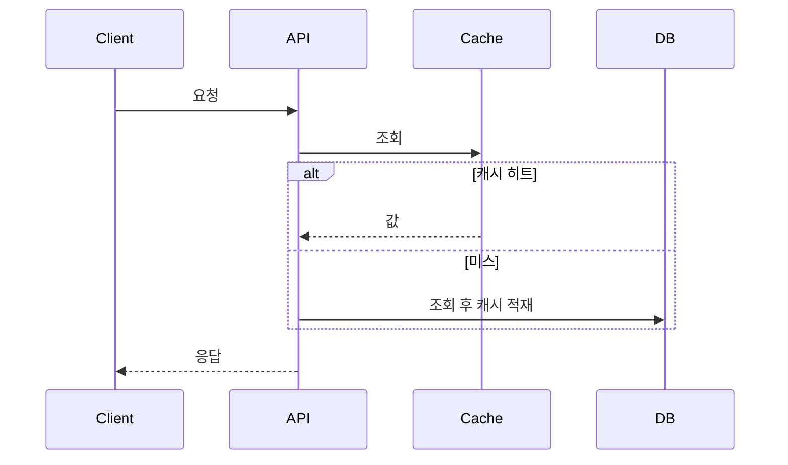
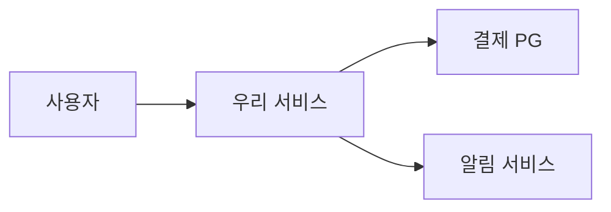
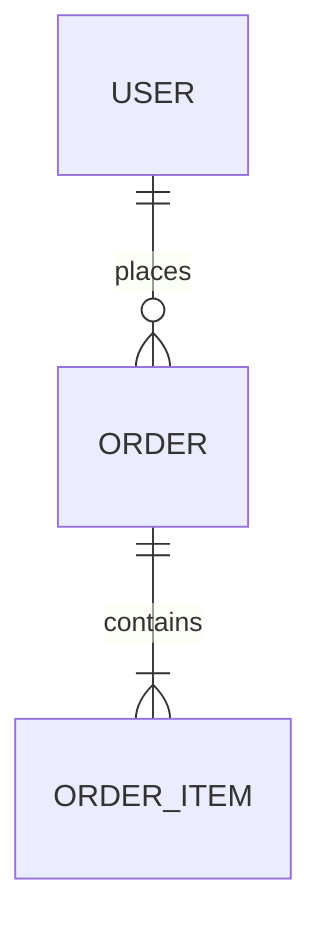

# Doc Templates

write-doc가 상황에 맞게 채워 제공하는 템플릿 모음. 각 템플릿은 그대로 복사해 빈 칸(`<...>`)만 채우면 됨.
`💡` 표시는 학습용 코칭 노트 — 실제 문서에선 지워도 됨.

**세트로 쓸 때 중복 방지:** 같은 정보를 여러 문서에 복사하지 말 것. 예) Acceptance Criteria 정본은 **PRD**가 소유하고, Jira Ticket은 링크만 단다. 한 사실은 한 문서에만.

---

## Problem Brief
> 문제가 애매할 때. "진짜 문제가 뭔가?"

```markdown
# Problem Brief: <한 줄 제목>

## Background
<지금 어떤 상황인가. 왜 이걸 지금 들여다보는가>

## Problem
<진짜 문제. 증상이 아니라 원인 가설>  💡 "느리다"가 아니라 "X 구간 p99가 N초라 이탈 발생"

## Impact
<누가/무엇이 얼마나 영향받나. 가능하면 숫자>

## Evidence
<로그, 지표, 사용자 피드백 등 근거>

## Goal
<이번에 달성할 것 1~3개>

## Non-goal
<이번엔 안 할 것>  💡 범위 폭주를 막는 가장 중요한 칸

## Next Step
<다음 액션: 누가 무엇을>
```

---

## PRD (Product Requirements Document)
> 기능 범위 합의. "무엇을 왜 만드나?"  (작으면 Summary~Acceptance Criteria만 → PRD Lite)

```markdown
# PRD: <기능명>

## Summary
<3~5줄. 이것만 읽어도 방향을 알 수 있게>  💡 BLUF: 결론 먼저

## Problem & Why now
<왜 이 기능이 필요한가, 왜 지금인가>

## Target User
<누가 쓰나. 페르소나/세그먼트>

## Goals / Non-goals
- Goals: <측정 가능한 목표>
- Non-goals: <이번에 안 다루는 것>

## User Stories
- As a <역할>, I want <행동>, so that <가치>.

## Requirements
- [ ] <기능 요구사항>
- [ ] <비기능 요구사항: 성능/보안/접근성>

## Acceptance Criteria
- Given <전제>, When <행동>, Then <결과>.  💡 QA·개발 공통 합격 기준

## Metrics
<성공을 어떤 지표로 판단하나>

## Open Questions
<아직 답 없는 것>
```

추천 다이어그램: Activity(사용자 흐름), State Machine (상태가 있으면).

---

## PRFAQ (Working Backwards)
> 신규 제품·기능 컨셉 검증. "고객이 이걸 왜 원하나?"  💡 Amazon식: *다 만든 척* 보도자료를 먼저 쓴다. 못 쓰면 컨셉이 아직 안 익은 것.

```markdown
# PRFAQ: <제품/기능명>

## Press Release (보도자료 — 출시일 시점에 쓴 것처럼)
**<헤드라인: 고객이 얻는 가치 한 줄>**
<부제: 누구를 위한 무엇인가>

<출시 문단: 무엇을 출시했고 왜 중요한가 — 고객 언어로>
<문제 문단: 지금 고객이 겪는 불편>
<해법 문단: 이 제품이 그걸 어떻게 없애나>
> "<고객 인용: 실제 사용자가 할 법한 칭찬>" — <가상의 고객>
<마무리: 어떻게 시작하나(call to action)>

## Customer FAQ (고객 관점: "내가 이걸 써야 하나?")
- Q: <이게 나한테 왜 필요한가?>
  A: <가치 — 외부에서 본 관점>
- Q: <기존 방법/경쟁 대비 뭐가 나은가?>
  A: ...
- Q: <비용/진입장벽은?>
  A: ...
💡 고객이 진짜 던질 질문만. 내부 사정 말고 "쓸까 말까"의 관점.

## Internal FAQ (내부 관점: "우리가 만들 수 있나, 해야 하나?")
- Q: 가장 어려운 기술 문제는? / 아직 못 만드는 건?
- Q: 단위 경제성(또는 비상용이면 유지보수 부담)은?
- Q: 첫 사용자 100명(또는 채택)은 어떻게 확보?
- Q: 이걸 죽이는 리스크는? 최악의 시나리오는?
- Q: 왜 우리가, 왜 지금?
- Q: 창업자가 피하고 싶은 질문 — 밤에 잠 못 들게 하는 그것
💡 "알아서 되겠지"는 답이 아님. 모르면 "뭘 하면 알 수 있고 언제까지 알아야 하나"로.
```

다음 단계: 검증 통과하면 → PRD로 구체화.

---

## RFC (Request for Comments)
> 기술 방향 합의. "이 방향으로 가도 되나?"

```markdown
# RFC: <제목>   (Status: Draft / In Review / Accepted / Rejected)

## Summary
<무엇을 제안하는가 3~5줄>

## Context
<현재 구조, 제약, 외부 의존성>

## Problem
<해결하려는 문제>

## Proposal
<제안하는 방향. 핵심 아이디어>

## Alternatives Considered
| 대안 | 장점 | 단점 | 채택 안 한 이유 |
|---|---|---|---|
| A | | | |
| B | | | |
💡 서구 RFC의 심장. 대안이 없으면 거의 반려됨.

## Trade-offs
<선택의 대가로 포기하는 것>

## Impact
<영향받는 팀/시스템/사용자>

## Risks
<위험과 완화책>

## Questions for Reviewers
<리뷰어에게 묻고 싶은 것>
```

추천 다이어그램: System Context, Container, Data Flow.

---

## Technical Design Doc
> 구현 설계. "어떻게 만드나?"  (작으면 Summary/Current/Proposed/Flow/Risks만 → Design Note)

```markdown
# Design Doc: <제목>

## Summary
<무엇을 왜 어떻게 바꾸는지 3~5줄>

## Goals / Non-goals
<범위>

## Current Architecture
<지금 구조>  💡 Container/Deployment Diagram

## Proposed Architecture
<바뀐 구조, 책임 분리>  💡 Container/Component Diagram

## Runtime Behavior
<요청/응답, 이벤트, 트랜잭션 흐름>  💡 Sequence Diagram — 정상/예외 분리

## Data Design
<테이블/스키마/이벤트 변경, 정합성>  💡 ERD

## Error Handling
<타임아웃, 재시도, fallback, 중복 방지>  💡 Failure Scenario

## Security
<인증/권한/개인정보/암호화> (민감 데이터 있으면)

## Performance
<latency/throughput/cache/index/병목> (성능 영향 있으면)

## Rollout & Rollback
<단계적 배포, feature flag, 되돌리는 조건과 절차>

## Observability
<로그/메트릭/트레이스/알림>

## Risks / Trade-offs
<남는 위험과 선택의 대가>

## Open Questions
<미결정>
```

설계 문서 섹션 순서 원칙은 SKILL.md "코칭 원칙" 참조 (Context → Architecture → ... → Observability).

---

## ADR (Architecture Decision Record)
> 중요한 선택 기록. "왜 이 선택을 했나?"  (짧게 유지)

```markdown
# ADR-<번호>: <결정 제목>
<!-- 💡 번호: 기존 ADR 폴더에서 가장 큰 번호 + 1. 처음이면 ADR-0001 (4자리 zero-pad) -->

- Status: Proposed / Accepted / Superseded by ADR-<n>
- Date: <YYYY-MM-DD>

## Context
<어떤 상황·제약에서 결정이 필요했나>

## Decision
<무엇을 선택했나>

## Options Considered
- Option A — <장단점>
- Option B — <장단점>

## Decision Drivers
<무엇을 가장 중요하게 봤나>

## Consequences
- 긍정: <얻는 것>
- 부정: <감수하는 것>

## Related
<관련 RFC / PR / 이슈 링크>
```

---

## Jira Ticket / User Story
> 작업 실행/추적. "누가 뭘 언제까지?"

```markdown
## <티켓 제목>

**Why**: <왜 필요한가>
**What**: <무엇을 한다>

**Acceptance Criteria**
- [ ] Given/When/Then ...  💡 PRD가 함께 있으면 여기 쓰지 말고 PRD AC를 링크

**Technical Notes**: <구현 힌트, 주의점>
**Dependencies**: <선행 작업/외부 의존>
**Test**: <어떻게 검증하나>
**Links**: <PRD/Design Doc/API Spec>
```

---

## PR Description
> 코드 변경 제출. "무엇을 왜 바꿨나?"

```markdown
## What
<무엇을 바꿨나>

## Why
<왜 필요했나 / 어떤 이슈>

## How
<핵심 구현 방식 요약>

## Risk
<무엇이 깨질 수 있나>

## Test
<어떻게 검증했나 — 결과 포함>

## Rollback
<문제 시 되돌리는 법>
```

---

## API Spec
> API 계약. "어떤 요청/응답인가?"

````markdown
# API: <엔드포인트 이름>

- **Endpoint**: `<METHOD> /path/{id}`
- **Auth**: <인증 방식 / 필요 권한>

## Request
| 위치 | 필드 | 타입 | 필수 | 설명 |
|---|---|---|---|---|
| path/query/body | | | | |

## Response (200)
```json
{ }
```

## Errors
| Code | 의미 | 발생 조건 |
|---|---|---|
| 400 | | |
| 401 | | |
| 409 | | |

## Validation
<검증 규칙>  💡 강제성은 RFC 2119 키워드로: MUST(반드시) / SHOULD(권장) / MAY(선택)

## Notes
<Rate limit / Pagination / Versioning / Idempotency>
````

추천 다이어그램: Sequence.

---

## Event Spec / Message Contract
> 이벤트 계약. "어떤 이벤트를 주고받나?"

````markdown
# Event: <이벤트명>

- **Producer**: <발행 주체>
- **Consumer(s)**: <소비 주체>
- **Trigger**: <언제 발행되나>
- **Delivery**: at-least-once / at-most-once / exactly-once

## Payload Schema
```json
{ }
```

## Semantics
- **Retry**: <재시도 정책>
- **DLQ**: <실패 메시지 처리>
- **Ordering**: <순서 보장 여부>
- **Idempotency / Dedup**: <중복 처리 키>
- **Versioning**: <호환성 전략>
````

추천 다이어그램: Data Flow, Sequence.

---

## Data Design / Migration Plan
> DB 변경. "데이터가 어떻게 바뀌나?"

````markdown
# Data Design: <제목>

## Entities & Tables
<엔티티, 테이블, 주요 컬럼, 관계>  💡 ERD

## Indexes & Constraints
<인덱스, 제약, 유니크>

## Migration
- Steps: <스키마 변경 순서>
- Backfill: <기존 데이터 채우는 법>
- Rollback: <되돌리는 절차>
- 배포 순서 / 락·성능 영향: <무중단 고려>

## Sample Verification
```sql
-- 검증 쿼리
```
````

추천 다이어그램: ERD, Data Flow(마이그레이션 단계).

---

## Release Plan
> 배포 준비. "어떻게 배포·롤백하나?"

```markdown
# Release Plan: <대상/버전>

## Scope
<무엇을 배포하나>

## Schedule
<언제, 누가>

## Pre-checks
- [ ] <배포 전 확인>

## Deployment Steps
1. <단계>  💡 canary / feature flag 단계 명시

## Post-checks
- [ ] <배포 후 확인 지표>

## Rollback
<중단 조건과 되돌리는 절차>

## Monitoring & Communication
<무엇을 보고, 누구에게 알리나>
```

추천 다이어그램: Deployment.

---

## Runbook
> 운영/장애 대응 절차. "문제 나면 어떻게 처리하나?"

````markdown
# Runbook: <상황/시스템명>

## Situation & Symptoms
<언제 쓰나, 어떤 증상>

## Impact
<영향 범위>

## Diagnosis
<원인 확인 단계>
```bash
# 확인 명령 / 쿼리
```

## Mitigation
<급한 불 끄기 — 임시 조치>

## Resolution
<근본 해결>

## Escalation
<안 풀리면 누구에게>

## Dashboards & Logs
<관측 링크>
````

추천 다이어그램: Failure Scenario, Observability.

---

## Postmortem
> 장애 후. "왜 터졌고 어떻게 막나?"  (Blameless)

```markdown
# Postmortem: <장애 제목>

## Summary
<무슨 일이 있었나 3~5줄>

## Impact
<누가/얼마나/얼마동안>

## Timeline
| 시각 | 사건 |
|---|---|
| | |
💡 추측과 사실을 분리해 적을 것

## Root Cause
<근본 원인 — 사람이 아니라 시스템/프로세스>

## Detection
<어떻게 알아챘나. 더 빨리 알 수 있었나>

## Response
<어떻게 대응했나>

## What Went Well / Wrong
- Well: <잘된 점>
- Wrong: <부족했던 점>

## Action Items
| 액션 | 담당 | 기한 |
|---|---|---|
| | | |
```

추천 다이어그램: Timeline, Failure Scenario.

---

## Mermaid 스니펫 (자주 쓰는 3종)
> Step 3에서 다이어그램 스텁을 줄 때 이 형태를 기준으로 채울 것. 나머지 타입은 이 패턴을 응용.

**Sequence** (정상/예외 흐름 분리):


**System Context** (외부 시스템 관계, 내부 컴포넌트는 넣지 말 것):


**ERD** (DB 구조 변경):


---

## Retrospective
> 작업 후 학습. "다음엔 어떻게 더 잘하나?"

```markdown
# Retrospective: <작업/스프린트명>

## Result
<무엇을 달성했나>

## What Worked
<유지할 것>

## What Didn't Work
<개선할 것>

## Lessons Learned
<배운 것>

## Next Time
<다음에 바꿀 행동>

## Reusable Pattern
<재사용할 만한 패턴/템플릿>
```
